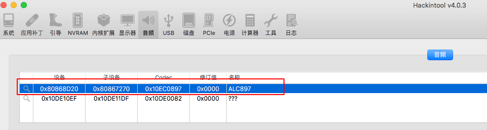
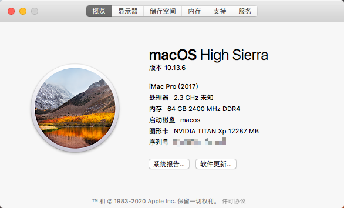
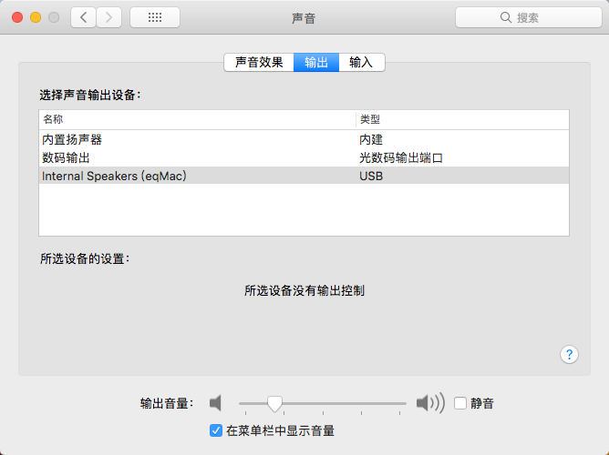

# x99-F8D-E52697v4-hackintosh
最近不想带笔记本回家，把家里的台式机安上了黑苹果。 因为显卡限制只能安装10.13.6,系统太老了，很多软件不支持，打算更换显卡重装高版本，记录一下。  
同配置和平台的可以直接抄作业。

配置：
- 主板： 华南金牌 X99-F8D
- CPU： E5-2697V4
- 显卡： GTX-TAITAN XP
- 硬盘： 西数-SN770 1TB

OC安装总体感受：
- 安装过程顺利
- 3个大坑  
  - 由于显卡最高只支持10.13.6,使用recover模式安装后的版本为17G66，webDriver驱动没有这个版本， 需要在appStore升级系统后安装（网上说可以改info.plist,然后重新签名，我试了好几次没有成功）
  - 国产Nvme硬盘不太行，看老吴的推荐 https://hpglw.com/cdc6109c.html
  - 声卡驱动，换了所有的layout-id 都不行，后来发现需要安装SSDT-HPET，需要使用SSDTTime提取  
    SSDTime下载：https://github.com/corpnewt/SSDTTime  
    acpidump下载： https://github.com/dortania/OpenCore-Install-Guide/blob/master/extra-files/acpidump.efi.zip
    教程： https://zhuanlan.zhihu.com/p/331606838  
    下载好 acpidump.efi 并且把它添加到 EFI/OC/Tools 中，并且在你的配置文件里 Misc -> Tools 中添加此项，将其 Arguments 设置为-b -n DSDT -z ，最后重启，在选择菜单中选择刚刚添加的这个选项（如果没看到的话可以按一下空格）  
如果在 OpenCore 中运行 acpidump.efi 出问题的话，你可以从 OpenShell 中运行它（记得 OpenShell 也需要添加到 EFI/OC/Tools 和 Misc -> Tools）：
    ```shell
        shell> fs0: // 使用正确的分区号  
        fs0:\> dir  // 此命令用以确认是否处于正确的分区  
          Directory of fs0:\  
          01/01/01 3:30p EFI  
        fs0:\> cd EFI\OC\Tools  
        fs0:\EFI\OC\Tools> acpidump.efi -b -n DSDT -z
    ```  
    
  
一些可能用到的资料：
- 这老哥说的非常细了，可以参考：https://blog.csdn.net/raspi_fans/article/details/125144685  
- OC的文档： https://dortania.github.io/OpenCore-Install-Guide/prerequisites.html
- 老吴工作室： https://hpglw.com/814eaee6.html

安装步骤：  
1. 确认好自己的配置（比如我一开始就记错了声卡型号），从OC文档、老吴工作室确定自己能不能安装、安装的最高版本。
2. 根据文档制作引导U盘, BIOS 等， BIOS 里面找不到的配置在config.plist 禁用。
3. 直接安...


可能遇到的问题（我遇到的问题）：
1. 无法与恢复服务器取得联系
在恢复模式的 "实用工具 > 系统终端" 里执行如下指令：
```shell
nvram IASUCatalogURL=https://swscan.apple.com/content/catalogs/others/index-10.16seed-10.16-10.15-10.14-10.13-10.12-10.11-10.10-10.9-mountainlion-lion-snowleopard-leopard.merged-1.sucatalog
```

2. webDriver 版本问题，上面说了，直接在app store 升级系统（安全性升级），从17G66 升级到17G14042  
3. 声卡驱动问题，一开始并不着急设置layout-id，安装后慢慢试，需要注意的是，需要在Hackintool中看到声卡才行。否则可能需要安装SSDT-HPET

   
截图

